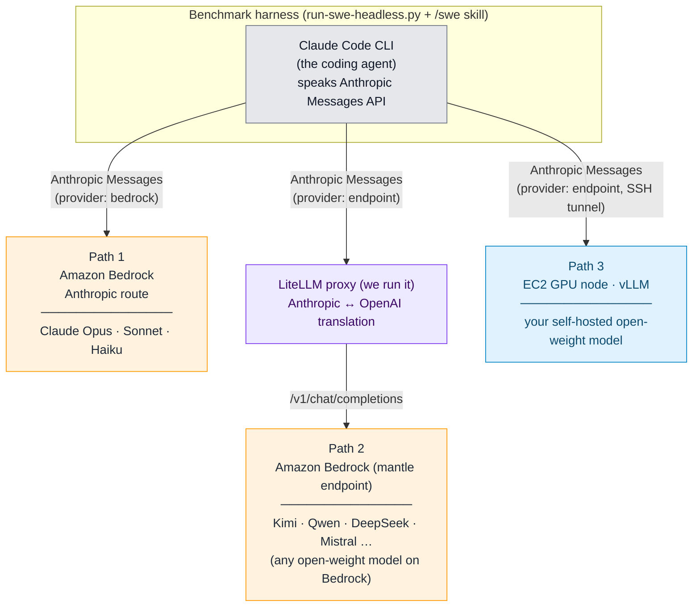
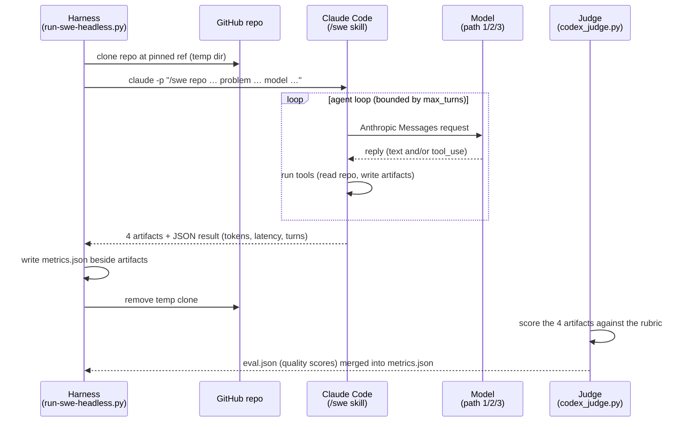

# Benchmark harness: test any model on real-world coding tasks with Claude Code

This is a benchmark and harness for measuring **how well different LLMs perform real-world software-engineering tasks** when driven by a coding agent. The coding agent is [Claude Code](https://docs.claude.com/en/docs/claude-code), and the harness lets you run Claude Code with a model hosted in any of **three different places** -- Anthropic models on Amazon Bedrock, open-weight models on Amazon Bedrock behind a proxy we run, or an open-weight model you serve yourself on EC2 -- while keeping everything else identical, so results are directly comparable.

Each task points the agent at a real GitHub repository and a real problem. The agent works the task **non-interactively** through the `/swe` skill, which lands four design artifacts on disk (`github-issue.md`, `lld.md`, `review.md`, `testing.md`). The harness records what the run cost -- token usage, latency, and the number of LLM turns -- and a separate [judge](docs/harness-reference.md#scoring-the-artifacts-the-judge) scores the artifacts for quality. The same task can then be run across many models and compared side by side on both cost and quality.

## The three hosting paths

Whichever path you choose, the agent (Claude Code), the tasks, the `/swe` skill, and the scoring are the same -- only *where the model runs and how the request reaches it* changes.



| | Path 1 - Anthropic on Bedrock | Path 2 - open-weight on Bedrock (LiteLLM) | Path 3 - self-hosted on EC2 (vLLM) |
| --- | --- | --- | --- |
| **Which models** | Anthropic family (Claude Opus, Sonnet, Haiku) | Any open-weight model on Bedrock (Kimi, Qwen, DeepSeek, Mistral, GLM, …) | Any open-weight model you can serve (Qwen3-Coder, GLM, Kimi, …) |
| **Where the model runs** | Amazon Bedrock | Amazon Bedrock | Your EC2 GPU instance |
| **How Claude Code reaches it** | Directly, native Anthropic route | Through a LiteLLM proxy we run that translates Anthropic ↔ OpenAI | Directly to your vLLM server (over an SSH tunnel) |
| **`provider`** | `bedrock` | `endpoint` (at the proxy) | `endpoint` (at vLLM) |
| **Extra infrastructure** | None | The LiteLLM proxy ([one script](scripts/bedrock-mantle-proxy.sh)) | An EC2 GPU node running vLLM |
| **Auth** | Ambient AWS credentials | Bedrock bearer token (the proxy mints it) | Local, no real key |
| **vLLM server metrics** | n/a (Bedrock) | n/a (proxy) | Full Prometheus cache + utilization metrics |
| **Best for** | Benchmarking the Anthropic family | Comparing open-weight models without managing GPUs | Throughput/cost analysis on a fixed-cost GPU node |
| **Operational guide** | [Path 1](docs/path-anthropic-on-bedrock.md) | [Path 2](docs/path-open-weight-on-bedrock-litellm.md) | [Path 3](docs/path-self-hosted-vllm.md) |

The key enabler for Path 2 is the LiteLLM proxy: Claude Code only speaks the Anthropic Messages API, and Bedrock's open-weight models speak OpenAI Chat Completions, so the proxy translates between the two in both directions -- letting **any open-weight model on Bedrock be wired into Claude Code** without changing the agent.

## What a single benchmark run does

The flow below is identical across all three paths; only the box the request lands in (Bedrock's Anthropic route, the LiteLLM proxy, or your vLLM server) changes.



For each selected task the harness clones the repo at its pinned ref, invokes `claude -p` non-interactively so the `/swe` skill produces the four artifacts, parses the run's JSON result for cost metrics, and writes them to `metrics.json` beside the artifacts. It runs with `--permission-mode acceptEdits` and a narrow allowlist; it never uses `bypassPermissions`. The judge then scores the artifacts and merges the quality scores into the same `metrics.json`. Full mechanics are in the [harness reference](docs/harness-reference.md).

## Datasets

A dataset is a single YAML file: a metadata header plus a list of tasks, each pointing at a GitHub repo and a problem. Two datasets ship in [dataset/](dataset/):

- [dataset/hello-world.yaml](dataset/hello-world.yaml) -- a trivial sanity dataset (the [octocat/Hello-World](https://github.com/octocat/Hello-World) repo) for kicking the tires of a new model or endpoint.
- [dataset/mcp-gateway-registry.yaml](dataset/mcp-gateway-registry.yaml) -- the reference dataset, whose tasks are drawn from real upstream issues in [agentic-community/mcp-gateway-registry](https://github.com/agentic-community/mcp-gateway-registry).

**Nothing in the harness is specific to a particular repository.** Adding your own benchmark dataset is just writing another YAML file in the same format -- point tasks at any public repo and pinned ref. The dataset format is documented in the [harness reference](docs/harness-reference.md#the-dataset).

## Getting started

1. **Set up the harness** (its own isolated virtual environment):

   ```bash
   cd benchmarks
   uv sync
   ```

2. **Create your runner config** from the template:

   ```bash
   cp config/runner.example.yaml config/runner.yaml
   ```

3. **Pick a path and follow its guide** -- each ends with a copy-pasteable run command:
   - [Path 1 - Anthropic models directly on Amazon Bedrock](docs/path-anthropic-on-bedrock.md)
   - [Path 2 - open-weight models on Amazon Bedrock via a LiteLLM proxy](docs/path-open-weight-on-bedrock-litellm.md)
   - [Path 3 - self-hosted open-weight models on EC2 with vLLM](docs/path-self-hosted-vllm.md)

4. **Read the shared mechanics** once, they apply to every path: the [harness reference](docs/harness-reference.md) covers the dataset format, the runner config, running the benchmark, the metrics file, and the judge.

## Documentation map

| Document | Covers |
| --- | --- |
| This README | Concepts: the three hosting paths, what a run does, datasets |
| [docs/harness-reference.md](docs/harness-reference.md) | Shared mechanics: dataset format, dataset loader, runner config, running the harness, metrics file, judge, dev workflow |
| [docs/path-anthropic-on-bedrock.md](docs/path-anthropic-on-bedrock.md) | Path 1 setup and run commands |
| [docs/path-open-weight-on-bedrock-litellm.md](docs/path-open-weight-on-bedrock-litellm.md) | Path 2 setup: the LiteLLM proxy and run commands |
| [docs/path-self-hosted-vllm.md](docs/path-self-hosted-vllm.md) | Path 3 setup: wiring a self-hosted vLLM endpoint and run commands |
| [../self-hosted/vllm/README.md](../self-hosted/vllm/README.md) | Standing up the vLLM server itself (Path 3 prerequisite) |
